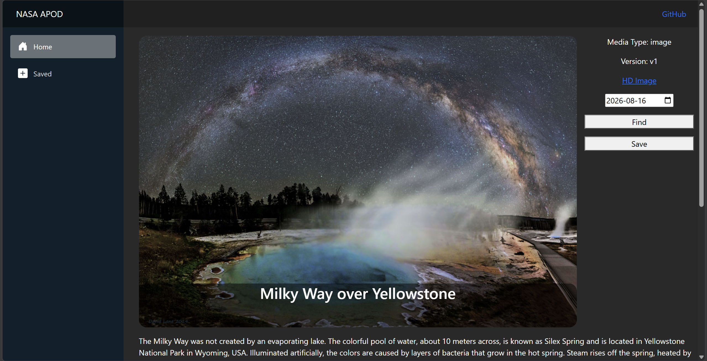
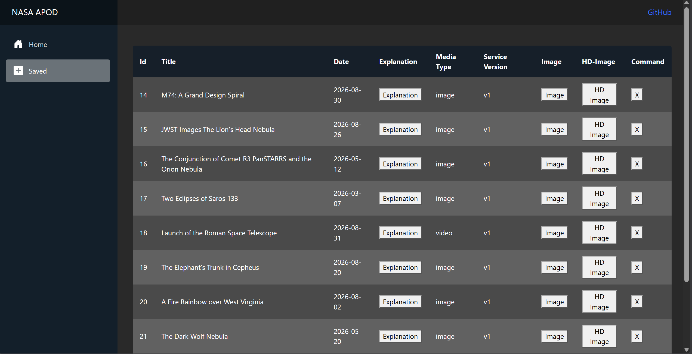

# NASA Astronomy Picture of the Day (APOD) Viewer

## A web application that retrieves and displays information from the NASA APOD API and allows you to save them to favourites.

The backend is built with ASP.NET Core in C#, using Entity Framework Core to handle communication with the SQLite database and the frontend is built with Blazor in C# using HTML and CSS for structure and styling.

## Features
- Use a calendar to select a date to see the corresponding APOD including the image, title, and explanation.
- Save the APOD and all its related information into a database where it can all be viewed later.

## Technologies Used
- Backend: C#, ASP.NET Core, EF Core, SQLite
- Frontend: C#, Blazor, HTML, CSS

### This project is current a WIP.